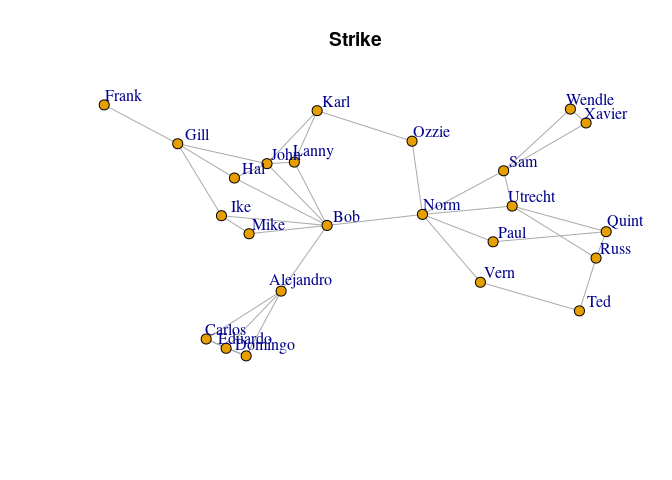
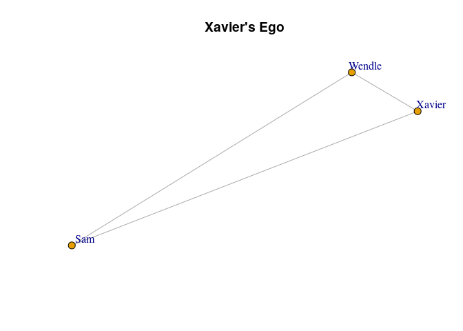
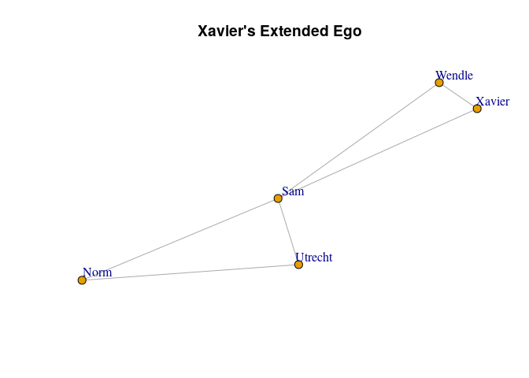
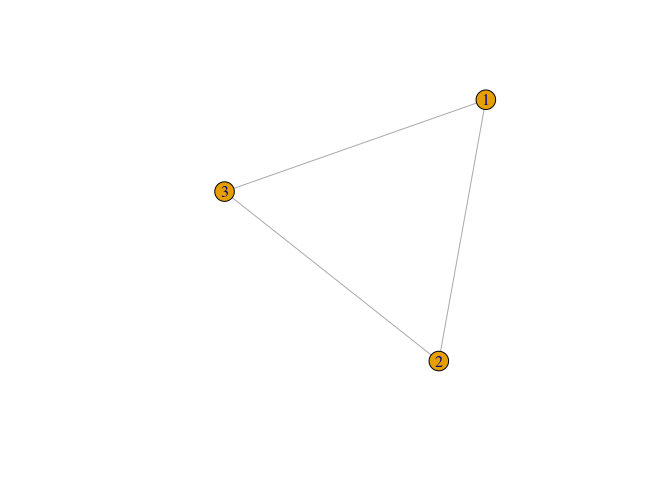
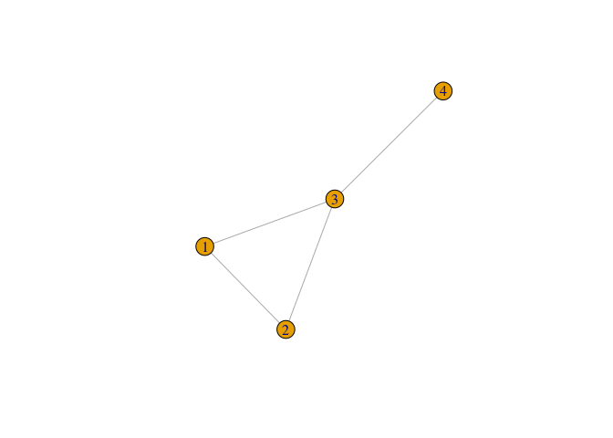

Constraint
================
Brendan Knapp

  - [Ego Model](#ego-model)
      - [UCINET Results](#ucinet-results)
      - [`{igraph}` Replication](#igraph-replication)
  - [“Whole Network”](#whole-network)
      - [UCINET Results](#ucinet-results-1)
      - [`{igraph}` Replication](#igraph-replication-1)
      - [“Whole Network”?](#whole-network-1)
          - [Ego](#ego)
          - [Extended Ego](#extended-ego)
      - [Confirmation](#confirmation)
  - [Maximum Constraint?](#maximum-constraint)

``` r
library(igraph, warn.conflicts = FALSE)
```

``` r
strike_net <- "*Vertices      24\r\n     1 \"Xavier\"    0.8220    0.7997\r\n     2 \"Utrecht\"    0.7189    0.5679\r\n     3 \"Frank\"    0.1500    0.8500\r\n     4 \"Domingo\"    0.3480    0.1500\r\n     5 \"Norm\"    0.5938    0.5446\r\n     6 \"Hal\"    0.3316    0.6461\r\n     7 \"Russ\"    0.8359    0.4228\r\n     8 \"Karl\"    0.4469    0.8339\r\n     9 \"Bob\"    0.4608    0.5138\r\n     10 \"Quint\"    0.8500    0.4964\r\n     11 \"Wendle\"    0.8001    0.8384\r\n     12 \"Ozzie\"    0.5793    0.7488\r\n     13 \"Ike\"    0.3135    0.5410\r\n     14 \"Ted\"    0.8127    0.2755\r\n     15 \"Sam\"    0.7070    0.6662\r\n     16 \"Vern\"    0.6746    0.3554\r\n     17 \"Gill\"    0.2525    0.7417\r\n     18 \"Lanny\"    0.4151    0.6905\r\n     19 \"Mike\"    0.3520    0.4907\r\n     20 \"Carlos\"    0.2922    0.1971\r\n     21 \"Alejandro\"    0.3967    0.3307\r\n     22 \"Paul\"    0.6923    0.4682\r\n     23 \"Eduardo\"    0.3200    0.1712\r\n     24 \"John\"    0.3770    0.6861\r\n*Arcs\r\n      1     11    1.0000\r\n      1     15    1.0000\r\n      2      5    1.0000\r\n      2      7    1.0000\r\n      2     10    1.0000\r\n      2     15    1.0000\r\n      3     17    1.0000\r\n      4     20    1.0000\r\n      4     21    1.0000\r\n      4     23    1.0000\r\n      5      2    1.0000\r\n      5      9    1.0000\r\n      5     12    1.0000\r\n      5     15    1.0000\r\n      5     16    1.0000\r\n      5     22    1.0000\r\n      6      9    1.0000\r\n      6     17    1.0000\r\n      6     24    1.0000\r\n      7      2    1.0000\r\n      7     10    1.0000\r\n      7     14    1.0000\r\n      8     12    1.0000\r\n      8     18    1.0000\r\n      8     24    1.0000\r\n      9      5    1.0000\r\n      9      6    1.0000\r\n      9     13    1.0000\r\n      9     18    1.0000\r\n      9     19    1.0000\r\n      9     21    1.0000\r\n      9     24    1.0000\r\n     10      2    1.0000\r\n     10      7    1.0000\r\n     10     22    1.0000\r\n     11      1    1.0000\r\n     11     15    1.0000\r\n     12      5    1.0000\r\n     12      8    1.0000\r\n     13      9    1.0000\r\n     13     17    1.0000\r\n     13     19    1.0000\r\n     14      7    1.0000\r\n     14     16    1.0000\r\n     15      1    1.0000\r\n     15      2    1.0000\r\n     15      5    1.0000\r\n     15     11    1.0000\r\n     16      5    1.0000\r\n     16     14    1.0000\r\n     17      3    1.0000\r\n     17      6    1.0000\r\n     17     13    1.0000\r\n     17     24    1.0000\r\n     18      8    1.0000\r\n     18      9    1.0000\r\n     18     24    1.0000\r\n     19      9    1.0000\r\n     19     13    1.0000\r\n     20      4    1.0000\r\n     20     21    1.0000\r\n     20     23    1.0000\r\n     21      4    1.0000\r\n     21      9    1.0000\r\n     21     20    1.0000\r\n     21     23    1.0000\r\n     22      5    1.0000\r\n     22     10    1.0000\r\n     23      4    1.0000\r\n     23     20    1.0000\r\n     23     21    1.0000\r\n     24      6    1.0000\r\n     24      8    1.0000\r\n     24      9    1.0000\r\n     24     17    1.0000\r\n     24     18    1.0000\r\n"
temp_file <- tempfile(fileext = ".net")
readr::write_file(strike_net, temp_file)

strike_g <- as.undirected(
  read_graph(temp_file, format = "pajek")
)

plot_igraph <- function(g, ...) {
  plot(g, asp = 0.5, 
       vertex.size = 4, vertex.label.dist = 1.5, ...)
}

plot_igraph(strike_g, main = "Strike")
```



# Ego Model

## UCINET Results

``` 
                   1
             Constra
                 int
             -------
 1    Xavier   1.125
 2   Utrecht   0.563
 3     Frank       1 ???? missing in ego.txt  
 4   Domingo   0.926
 5      Norm   0.236
 6       Hal   0.840
 7      Russ   0.611
 8      Karl   0.611
 9       Bob   0.287
10     Quint   0.611
11    Wendle   1.125
12     Ozzie   0.500
13       Ike   0.611
14       Ted   0.500
15       Sam   0.563
16      Vern   0.500
17      Gill   0.406
18     Lanny   0.840
19      Mike   1.125
20    Carlos   0.926
21 Alejandro   0.583
22      Paul   0.500
23   Eduardo   0.926
24      John   0.522
```

``` r
ucinet_ego_results <- c(
  1.125, 0.563, 1, 0.926, 0.236, 0.840, 0.611, 0.611, 0.287, 0.611, 1.125, 
  0.500, 0.611, 0.500, 0.563, 0.500, 0.406, 0.840, 1.125, 0.926, 0.583, 0.500, 0.926, 0.522
)
```

## `{igraph}` Replication

Extract each vertex’s ego (order = 1) network and run
`igraph::constraint()` on them individually.

``` r
ego_constraint <- function(g, .order = 1L, .round = 3L, .nm = FALSE) {
  if (!is_named(g)) {
    vertex_attr(g, "name") <- sprintf("n%d", seq_len(vcount(g)))
  }
  
  ego_nets <- make_ego_graph(g, order = .order) # get all ego networks
  ego_names <- vertex_attr(g, "name") # grab the egos' names
  
  # walk through each ego network and measure constraint of the ego vertex
  out <- mapply(function(.ego_net, .ego_name) { 
    constraint(.ego_net, nodes = .ego_name)
  }, ego_nets, ego_names)
  
  out <- round(out, .round)
  if (.nm) out else unname(out)
}

data.frame(
  name = vertex_attr(strike_g, "name"), 
  `UCINET "Ego"` = round(ucinet_ego_results, 2),
  `ego_constraint()` = ego_constraint(strike_g, .round = 2),
  check.names = FALSE
)
```

    #>         name UCINET "Ego" ego_constraint()
    #> 1     Xavier         1.12             1.12
    #> 2    Utrecht         0.56             0.56
    #> 3      Frank         1.00             1.00
    #> 4    Domingo         0.93             0.93
    #> 5       Norm         0.24             0.24
    #> 6        Hal         0.84             0.84
    #> 7       Russ         0.61             0.61
    #> 8       Karl         0.61             0.61
    #> 9        Bob         0.29             0.29
    #> 10     Quint         0.61             0.61
    #> 11    Wendle         1.12             1.12
    #> 12     Ozzie         0.50             0.50
    #> 13       Ike         0.61             0.61
    #> 14       Ted         0.50             0.50
    #> 15       Sam         0.56             0.56
    #> 16      Vern         0.50             0.50
    #> 17      Gill         0.41             0.41
    #> 18     Lanny         0.84             0.84
    #> 19      Mike         1.12             1.12
    #> 20    Carlos         0.93             0.93
    #> 21 Alejandro         0.58             0.58
    #> 22      Paul         0.50             0.50
    #> 23   Eduardo         0.93             0.93
    #> 24      John         0.52             0.52

``` r
identical(
  round(ucinet_ego_results, 2), 
  ego_constraint(strike_g, .round = 2)
)
```

    #> [1] TRUE

# “Whole Network”

Identical to `igraph::constraint()`.

## UCINET Results

``` 
                  3
              Const
              raint
              -----
 1    Xavier  0.953
 2   Utrecht  0.405
 3     Frank      1
 4   Domingo  0.866
 5      Norm  0.198
 6       Hal  0.536
 7      Russ  0.482
 8      Karl  0.469
 9       Bob  0.238
10     Quint  0.482
11    Wendle  0.953
12     Ozzie  0.500
13       Ike  0.506
14       Ted  0.500
15       Sam  0.464
16      Vern  0.500
17      Gill  0.326
18     Lanny  0.562
19      Mike  0.771
20    Carlos  0.866
21 Alejandro  0.583
22      Paul  0.500
23   Eduardo  0.866
24      John  0.418
```

``` r
ucinet_whole_results <- c( 
  0.953, 0.405, 1, 0.866, 0.198, 0.536, 0.482, 0.469, 0.238, 0.482, 0.953,
  0.500, 0.506, 0.500, 0.464, 0.500, 0.326, 0.562, 0.771, 0.866, 0.583, 
  0.500, 0.866, 0.418
)
```

## `{igraph}` Replication

``` r
constraint(strike_g)
```

    #>    Xavier   Utrecht     Frank   Domingo      Norm       Hal      Russ      Karl       Bob     Quint    Wendle     Ozzie       Ike       Ted       Sam      Vern      Gill     Lanny      Mike    Carlos 
    #> 0.9531250 0.4049479 1.0000000 0.8657407 0.1979167 0.5355612 0.4822531 0.4686420 0.2384807 0.4822531 0.9531250 0.5000000 0.5062358 0.5000000 0.4639757 0.5000000 0.3261111 0.5621265 0.7709751 0.8657407 
    #> Alejandro      Paul   Eduardo      John 
    #> 0.5833333 0.5000000 0.8657407 0.4181009

``` r
data.frame(
  name = vertex_attr(strike_g, "name"),
  `UCINET "Whole Network"` = ucinet_whole_results,
  `igraph::constraint()` = round(constraint(strike_g), 3L),
  check.names = FALSE,
  row.names = NULL
)
```

    #>         name UCINET "Whole Network" igraph::constraint()
    #> 1     Xavier                  0.953                0.953
    #> 2    Utrecht                  0.405                0.405
    #> 3      Frank                  1.000                1.000
    #> 4    Domingo                  0.866                0.866
    #> 5       Norm                  0.198                0.198
    #> 6        Hal                  0.536                0.536
    #> 7       Russ                  0.482                0.482
    #> 8       Karl                  0.469                0.469
    #> 9        Bob                  0.238                0.238
    #> 10     Quint                  0.482                0.482
    #> 11    Wendle                  0.953                0.953
    #> 12     Ozzie                  0.500                0.500
    #> 13       Ike                  0.506                0.506
    #> 14       Ted                  0.500                0.500
    #> 15       Sam                  0.464                0.464
    #> 16      Vern                  0.500                0.500
    #> 17      Gill                  0.326                0.326
    #> 18     Lanny                  0.562                0.562
    #> 19      Mike                  0.771                0.771
    #> 20    Carlos                  0.866                0.866
    #> 21 Alejandro                  0.583                0.583
    #> 22      Paul                  0.500                0.500
    #> 23   Eduardo                  0.866                0.866
    #> 24      John                  0.418                0.418

``` r
identical(
  ucinet_whole_results,
  constraint(strike_g) %>% round(3L) %>% unname()
)
```

    #> [1] TRUE

## “Whole Network”?

What UCINET is calling “Whole Network” is misleading. It’s measuring the
“extended” ego networks (order = 2).

“Whole Network” may be representative of the other “Whole Network”
Structural Holes measures is produces, but it’s not relevant to Burt’s
Constraint.

### Ego

``` r
ego_g <- make_ego_graph(strike_g, nodes = "Xavier")[[1L]]
plot_igraph(ego_g, main = "Xavier's Ego")
```



### Extended Ego

``` r
extended_ego_g <- make_ego_graph(strike_g, order = 2L, nodes = "Xavier")[[1L]]
plot_igraph(extended_ego_g, main = "Xavier's Extended Ego")
```



## Confirmation

``` r
extended_ego_constraint <- function(g, ...) {
  ego_constraint(g, .order = 2L, ...)
}

data.frame(
  `igraph::constraint()` = round(constraint(strike_g), 3L),
  `extended_ego_constraint()` = extended_ego_constraint(strike_g),
  `UCINET "Whole Network"` = ucinet_whole_results,
  check.names = FALSE,
  row.names = NULL
)
```

    #>    igraph::constraint() extended_ego_constraint() UCINET "Whole Network"
    #> 1                 0.953                     0.953                  0.953
    #> 2                 0.405                     0.405                  0.405
    #> 3                 1.000                     1.000                  1.000
    #> 4                 0.866                     0.866                  0.866
    #> 5                 0.198                     0.198                  0.198
    #> 6                 0.536                     0.536                  0.536
    #> 7                 0.482                     0.482                  0.482
    #> 8                 0.469                     0.469                  0.469
    #> 9                 0.238                     0.238                  0.238
    #> 10                0.482                     0.482                  0.482
    #> 11                0.953                     0.953                  0.953
    #> 12                0.500                     0.500                  0.500
    #> 13                0.506                     0.506                  0.506
    #> 14                0.500                     0.500                  0.500
    #> 15                0.464                     0.464                  0.464
    #> 16                0.500                     0.500                  0.500
    #> 17                0.326                     0.326                  0.326
    #> 18                0.562                     0.562                  0.562
    #> 19                0.771                     0.771                  0.771
    #> 20                0.866                     0.866                  0.866
    #> 21                0.583                     0.583                  0.583
    #> 22                0.500                     0.500                  0.500
    #> 23                0.866                     0.866                  0.866
    #> 24                0.418                     0.418                  0.418

``` r
identical(
  constraint(strike_g) %>% round(3) %>% unname(),
  extended_ego_constraint(strike_g)
)
```

    #> [1] TRUE

``` r
identical(
  extended_ego_constraint(strike_g), 
  ucinet_whole_results
)
```

    #> [1] TRUE

# Maximum Constraint?

Either interpretation of Burt’s Constraint can yield values \> 1.

``` r
el <- matrix(
  c(1, 2, 
    1, 3, 
    2, 3), ncol = 2L, byrow = TRUE)

g <- graph_from_edgelist(el, directed = FALSE) 
plot(g)
```



``` r
g %>% ego_constraint()
```

    #> [1] 1.125 1.125 1.125

``` r
g %>% constraint()
```

    #> [1] 1.125 1.125 1.125

``` r
el <- matrix(
  c(1, 2, 
    1, 3, 
    2, 3,
    3, 4), ncol = 2L, byrow = TRUE)

g <- graph_from_edgelist(el, directed = FALSE) 
plot(g)
```



``` r
g %>% ego_constraint()
```

    #> [1] 1.125 1.125 0.611 1.000

``` r
g %>% constraint()
```

    #> [1] 1.0069444 1.0069444 0.6111111 1.0000000

``` r
el <- matrix(
  c(1, 2, 
    1, 3, 
    2, 3,
    3, 4,
    4, 5), ncol = 2L, byrow = TRUE)

g <- graph_from_edgelist(el, directed = FALSE) 
plot(g)
```


``` r
g %>% ego_constraint()
```

    #> [1] 1.125 1.125 0.611 0.500 1.000

``` r
g %>% constraint()
```

    #> [1] 1.0069444 1.0069444 0.6111111 0.5000000 1.0000000
